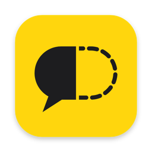
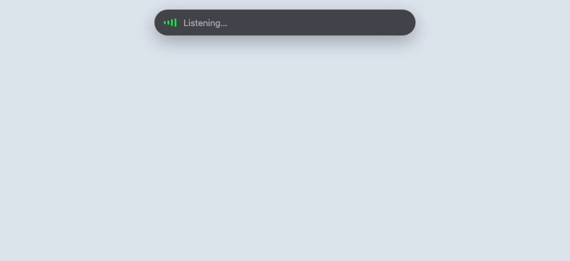
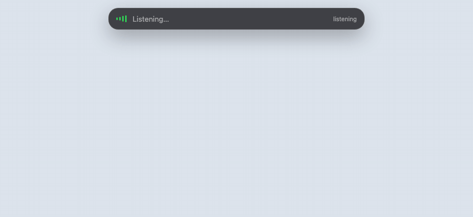

<p align="center">
  
</p>

<h1 align="center">halfsay</h1>

<p align="center">Voice control for macOS that acts on half a sentence.</p>

<p align="center">
  <a href="../../releases/latest/download/halfsay-macos-arm64.dmg"></a>
  <a href="LICENSE"></a>
</p>

<p align="center">
  
  <br>
  <sub>Replay of a real <code>--text</code> run, drawn as the bar: Notes opened 0.88 s before the last word.</sub>
</p>

Say "abre as notas e digita bom dia" and Notes is already open while you are still saying "digita".

It asks [Jev](https://typesafe.ai/blog/introducing-system-one-models-and-jev), TypeSafe's System One model, about every word you say. Jev answers with typed decisions and probabilities, not text, in about 200 ms, so the app can act mid-sentence and wait only when it has to.

## Install

1. Download [halfsay-macos-arm64.dmg](../../releases/latest/download/halfsay-macos-arm64.dmg), open it and drag halfsay to Applications. [Releases](../../releases) has a zip too.
2. It is not notarized yet, so macOS blocks the first open. Go to System Settings → Privacy & Security → **Open Anyway**.
3. A pill floats at the top of the screen. Press **⌥Space** (or its ▶ button), paste your Jev API key from [console.typesafe.ai](https://console.typesafe.ai), and allow the Microphone and Speech Recognition.
4. For typing and ⌘N, turn halfsay on in System Settings → Privacy & Security → Accessibility.

Apple Silicon, built for macOS 14 and later, tested on macOS 26 (where the bar is Liquid Glass). ⌥Space or ⏸ pauses; the mic is off while paused. Drag the bar anywhere.

## What you can say

| Say | It does |
|---|---|
| "open the notes app", "abre o Safari" | opens the app, often before you finish the sentence |
| "create a new note", "cria uma nota nova" | ⌘N in the app in front |
| "abre o linkedin no google", "open x dot com" | opens the site |
| "pesquisa receita de pão de queijo", "google search norbert wiener" | searches, in the browser in front |
| "digita bom dia", "make the title say hello" | types into the app in front |

Chain them in one breath: "abre o terminal e digita ls". It listens in your Mac's language; Portuguese is tested by voice, English with the probe below.

## How it decides

<p align="center">
  
</p>

- Every partial transcript goes to Jev in one request: what to do, which app, which words are the argument, and a yes/no "does it ask to open an app?".
- **Opening an app fires mid-sentence** once two partials in a row agree and the app is named beyond doubt. A new item needs 0.85.
- **Search, site and typing wait for the pause**: "search norbert" is not "search norbert wiener" until you stop.
- **At the pause it acts on the outcome, not the label.** Going to LinkedIn, searching for it, or opening the browser you named all land on LinkedIn, so their probabilities add up; typing and creating a note do not.
- **Jev never writes text.** Code cuts every span of what you said, Jev picks one, and it is copied verbatim. Spans made of the command itself ("digita", "pesquisar") are never offered.
- A command ends where its own words end, plus any "how or where" ("no Google", "por favor"), so the rest of the sentence becomes the next command.

## Measured

- By voice: Chrome opened **5.6 s** before the end of the sentence, Terminal 5.2 s, Notes 3.0 s.
- Jev answers in ~205 ms on a warm connection; a fresh TLS handshake alone costs ~440 ms. The API speaks HTTP/2, so the first words of a sentence warm it.
- `swift run jev-probe` replays 15 sentences word by word against the real API and grades them: **13/15**. The two misses are text that reads like a task ("escreve lista de compras").

## Privacy

Speech becomes text on your Mac with Apple's recognizer (on-device when your language supports it). Only the words go to Jev. `--log` keeps a local trace in `~/Library/Logs/halfsay/`, off by default: it holds everything the mic hears. What it can type, where the key lives and how to report a problem: [SECURITY.md](SECURITY.md).

## Limitations

- Not notarized, and each build is signed ad hoc, so macOS may ask for the permissions again after an update.
- It cannot click buttons in other apps: it does not read the screen yet.
- Text that sounds like a task ("escreve lista de compras") may do nothing, and the waveform is decorative.

## Build from source

```sh
echo 'TYPESAFE_API_KEY=...' > .env && make key   # the app reads ~/.config/halfsay/api-key
make test                                        # Swift Testing; the Makefile finds it with only the Command Line Tools
make app && open build/halfsay.app --args --dry-run --log
swift run halfsay --text "abre o safari e pesquisa receita de pão de queijo" --dry-run   # no mic
```

The decision logic lives in `HalfsayCore` and is tested offline; `Sources/halfsay` is glue over Apple APIs. Notes for coding agents: [AGENTS.md](AGENTS.md). A `v*` tag tests, builds and publishes a release with a dmg and a zip.

## Contributing

Found a sentence it gets wrong? Run it with `--log` and open an issue with the lines for that sentence. How to test a change, and what the eval costs: [CONTRIBUTING.md](CONTRIBUTING.md).

## License

[MIT](LICENSE)
